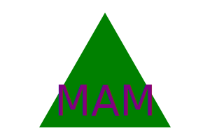
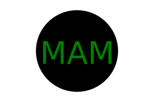
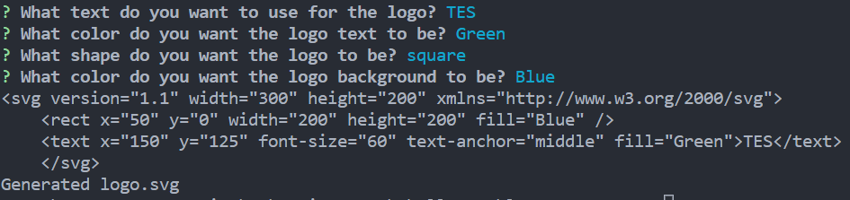
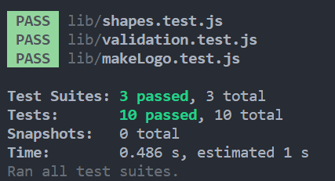

# Logoenerator

## Description

This application generates "logo" svgs based on the users inputs. Currently the application allows for 3 shapes "Circle", "Square, and "Triangle" with 1-3 letters. It accepts all basic CSS color string values as well as hex values. It offers data validation to insure the user is entering valid hex and color string values. The application includes a test suite custom build using "Jest.js".

This application requires "Node.js", "Jest.js" installation as well as "inquirer.js" installation.

Node can be installed directly from [https://nodejs.org/en](https://nodejs.org/en).

Inquirer.js can be installed once in the root directory via NPM with the CLI command "npm i inquirer" or just simply by using "npm install" [https://www.npmjs.com/package/inquirer](https://www.npmjs.com/package/inquirer)

Jest.js can be installed once in the root directory via NPM with the CLI command "npm install --save-dev jest" or just simply by using "npm install" [https://jestjs.io/](https://jestjs.io/)

This was a project during the Full Stack Web Development Bootcamp at UC Berkeley Ext.

#### Example photos:

[](./examples/example-one.svg)
[](./examples/example-two.svg)
[](./examples/example-three.svg)

## Installation

1. Clone the repository using "git clone git@github.com:MeanBean87/logo-generator.git"
2. Navigate to the root directory of the project using CLI.
3. Install node modules using "npm install"
4. Video walkthrough of installation can be found [here](https://drive.google.com/file/d/110NqHskqjoa6WaO4SMr7QOFR8tiJ-se3/view). or at URL: [https://drive.google.com/file/d/1uc42Uf1VRRS1AzRkezTrEXJmjrmckzsu/view](https://drive.google.com/file/d/110NqHskqjoa6WaO4SMr7QOFR8tiJ-se3/view).

## Usage

1. After following the installation guide, type "node index.js".
2. Answer the prompts.
3. Once the final prompt is answered you will get a message indicating if it was successful or not.
4. There will be a new file in the root directory named "logo.svg"
5. Copy the file to your desired location.

Photo of CLI Prompts:



## Code Highlights

Snippet of one of the test routines.

```
describe("Circle", () => {
  test("Circle should render a circle", () => {
    const color = "red";
    const text = "ABC";
    const textColor = "blue";

    const circle = new Circle(color, text, textColor);

    const expected =  `<svg version="1.1" width="300" height="200" xmlns="http://www.w3.org/2000/svg">
    <circle cx="150" cy="100" r="80" fill="red" />
    <text x="150" y="125" font-size="60" text-anchor="middle" fill="blue">ABC</text>
    </svg>`;

    expect(circle.render()).toBe(expected);
  });
});
```

## Learning Points

During the development of this project I learned how to use and create classes, as well as using jest for unit testing. 

## Testing

This application uses jest to perform a slew of custom made tests to validate the correct output is being generated.

These tests include a test for data validation from the CLI, logical conditions for the makeLogo function as well as output from render().

Steps:

1. Clone the repository using "git clone git@github.com:MeanBean87/logo-generator.git"
2. Once inside of the command line use "npm install" to install the dependencies.
3. After the dependencies have installed without errors, from the command line enter "npm test".
4. This will begin the Jest suite, and the results will be provided in the command line.

#### Photo of successful test:


## Badges

[](https://developer.mozilla.org/en-US/docs/Web/JavaScript) [](https://nodejs.org/) [](https://www.npmjs.com/package/inquirer) [](https://git-scm.com/) [](https://github.com/MeanBean87) [](https://jestjs.io/)


## Author / Collaberators

Michael Mattingly

* [GitHub](https://github.com/MeanBean87)
* [LinkedIn](https://www.linkedin.com/in/michael-mattingly-5580b1280/)

This project was created with source code provided from UC Berkeley Extension.

## License

This project is licensed under the [MIT License](https://github.com/MeanBean87/readme-generator/blob/main/LICENSE). Please refer to the LICENSE file for more details.
